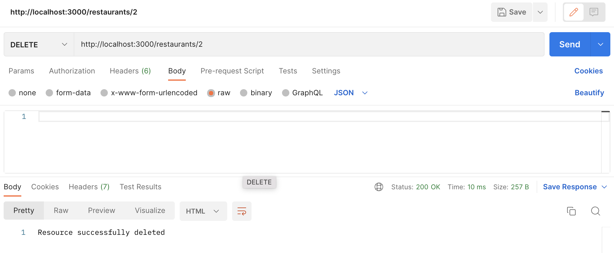
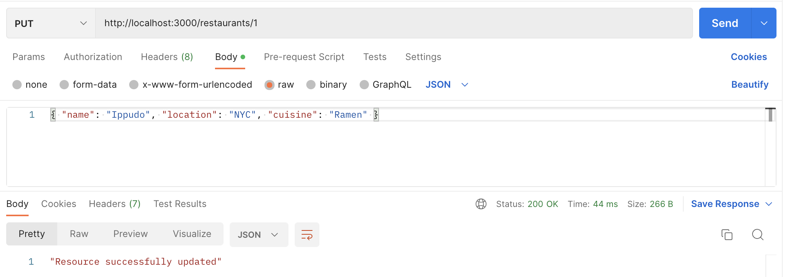

# Express Restaurants
Over the next series of lessons we will be building an application using Express that will be able to `GET`, `POST`, `PUT`, and `DELETE` values stored in a database. 

## Setup
After forking and cloning the repository, run the following (`npm run seed` runs the seed file):

```bash
npm install
npm run seed
npm start
```

## Part 1: `GET` Restaurants
1. In the `app.js` file, create a `GET` request using Express for the `/restaurants` endpoint.
2. In the `GET` request, return all restaurants via the `Restaurant.findAll()` method. 
    - Remember to use `async` and `await`
    - Note that you will need to run `npm run seed` once in order to put data into the restaurant database.
3. Send the restaurants as a JSON Response (`res.json()`).
4. Start your server with `node server.js`.
5. Test your endpoint by visiting http://localhost:3000/restaurants. Your response should look similar to the one shown below:


## Part 2: Route Parameters
1. In your `app.js` file, Use Express to create `GET /restaurants/:id` endpoint.
2. In `GET /restaurants/:id` get the id using the `req.params` object.
3. In `GET /restaurants/:id` get the particular restaurant via the method `findByPk()`.
4. Send the found restaurant as a JSON response (`res.json()`).
5. Start your server with `node server.js`.
5. Test your endpoint using Postman or your browser by sending a `GET` request to `http://localhost:3000/restaurants/1`. Your browser should output the following on Postman:


## Part 3: `POST`, `PUT`, and `DELETE` Restaurants
In `src/app.js`:
1. Call `app.use()` and pass it `express.json()` so that we can parse the request body that contain JSON objects.
2. Call `app.use()` and pass it `express.urlencoded()` so that we can parse the request body with urlencoded values.
2. Create an Express route for creating (adding) a new restaurant on your restaurant database.
3. Create an express route for updating (replacing) an existing restaurant with a new restaurant on your restaurant database based on ID in the route. 
    - For example, `restaurant/2` would update the restaurant with an ID of 2.
4. Create an express route for deleting (removing) a restaurant on your database based on the id in the route.
    - For example, `restaurant/2` would delete the restaurant with an ID of 2.
5. Test  your endpoints on Postman by making a `GET`, `POST`, `PUT`, and `DELETE` requests to http://localhost:3000/restaurants/

### Sending HTTP Requests with Postman

**`DELETE`**

`DELETE` requests typically do not have a request body. To send these requests in Postman:

1. Start the server using node server.js. 
2. Copy the URL (something like https://localhost:3000/restaurants/1) into Postman. 
3. Set the method to `DELETE`
4. Send the request. 
5. When you refresh the URL, you will see the value has been deleted.



**`PUT` and `POST`**

Creating and updating values with `POST` and `PUT` requests requires that we send information in the body of the HTTP request. To send these requests in Postman:

1. Set the method to `PUT` or `POST`
2. In Postman, select Body and then "raw". 
3. Paste the object into the body and ensure it is formatted correctly (i.e. JSON key values need to be in quotes).
4. Send the request
5. Refresh the page to see the updated array of values.



## Part 4: Express Router
1. Create a new directory called `routes` for your Express router(s)
2. Include a file (like `restaurants.js`) within the `routes` directory to represent your Express router
3. Define your Express router to be able to handle creating, reading, updating, and deleting resources from your Restaurants database.
4. Export your restaurants router
5. Include a reference to your router in your `app.js`
6. Use the Express router in your main server
7. Remove any pre-defined routes from your main server and use only your Express router.
8. Test your endpoints using Postman

## Part 5: Unit Tests
1. In `package.json`, update the test script to be `"test": "jest --watchAll"`.
2. In the root directory, create an `index.test.js` file.
    ```shell
    npm install supertest
    ```
3. Create tests that accomplish the following:
    - Verify that the `GET /restaurants` route returns a status code of 200.
    - Verify that `GET /restaurants` route returns an array of restaurants
    - Test that `GET /restaurants` returns the correct number of restaurants
    - Test that `GET /restaurants` returns the correct restaurant data
    - Verify that `GET /restaurants/:id` request returns the correct data.
    - Test that `POST /restaurants` request returns the restaurants array has been updated with the new value.
    - Verify that `PUT /restaurants/:id` request updates the restaurant array with the provided value
    - Test that `DELETE /restaurant/:id` deletes the restaurant with the provided id from the array.

## Part 6: Server Side Validation
1. Run `npm install express-validator` to install the Express Validator package
2. Include the `check` and `validationResult` methods from the Express Validator package in your Express router for restaurants.
3. Navigate to your POST Request route to `/restaurants` from your Express Router and include a parameter `[]` in between the endpoint and the callback function. 
4. Within the array `[]` include a first item which checks that the `"name"` field in the `request.body` is not empty and doesn’t only contain whitespace
5. Within the array `[]` include a second item that checks that the `"location"` in the `request.body` is not empty and doesn’t only contain whitespace
6. Within the array `[]` include a third item that checks that the `"cuisine"` is the `request.body` is not empty and doesn’t only contain whitespace
7. Within the callback function, validate the results of your checks and store them in a variable named `errors`
8. Check that if the errors reference is not empty (there are errors), respond with a JSON that contains the key error and the value `errors.array()`
9. If the `errors` reference is empty (there are no errors), then continue with adding the restaurant to the Restaurant DB and return a list of all the restaurants including the newly added one.
10. Test your endpoint using Postman. Check to see if you can add a restaurant without any of the `"name"`, `"location"`, and/or `"cuisine"` fields.
11. In index.test.js, create unit tests that test that an errors array is returned when the `"name"`, `"location"`, and/or `"cuisine"` fields are empty

## Extension Problems 🚀

### Express Restaurant Bonus - Associations

**TASK**: Create a new `Item` and `Menu` model and define the associations between the three models. Update the GET /restaurants route to GET a list of all the Restaurants in the Restaurant database, including the `Menu`(s) that belong to that restaurant, and including the `Item`(s) that belong to that `Menu`. 

1. In the models directory define a `Menu` model. The `Menu` model should have the following properties:
    - `title`: a string
2. In the models directory define an `Item` model. The `Item` model should have the following properties:
    - `name`: a string
    - `image`: a string
    - `price`: a number
    - `vegetarian`: a boolean
3. Export the models and import into `models/index.js`
4. In `models/index.js`, define the following association:
    - A Restaurant may have one or more `Menu`(s), but every `Menu` has one `Restaurant`
    - There are also many `Item`(s) included in a `Menu` and an `Item` can be on many `Menu`s
5. In `seed.js`:
    - Import the `Menu` and `Item`. 
    - Import the `seedMenu` and `seedItem` data.
    - Update the `syncSeed` function to bulk create new `Menu` and `Item` instances.
6. Navigate to your `GET /restaurants` route.
7. Since you’re making a call to a database, don’t forget to use `async` and `await` as part of the callback argument.
8. Use Express to load all of the restaurants from the `Restaurant` model.
9. Within your Sequelize method to find all of the restaurants in the model, include several arguments
    - Include the `Menu`s as part of the response
    ```javascript
    {include: Mode1} //Argument 1
    ```
    - Include from the menu, the items in that menu
    ```javascript
    {
        include: Mode1, //Which model should we add here?
            include: [{
                model: Mode1,
                include: [{
                    model: Model2 //Which model should we add here?
                }]
            }]
    }
    //Argument 2
    ```
10. Test your `GET /restaurants` endpoint using Postman.

### Express Validator

**Bonus Assignment**: Within the same POST /restaurant route above, use Express Validator to check that the value added to the "name" field on a restaurant has a length between 10 and 30 characters.
- [You may use this reference](https://github.com/validatorjs/validator.js#validators) 🔍 to help you find the correct method for your solution.

1. Include a fourth item within your array `[]` that checks that the `"name"` field has a length between 10 and 30. (Minimum 10, Maximum 30)
2. [Use this reference](https://github.com/validatorjs/validator.js#validators) to locate the best method for checking the length of the value passed into the restaurant’s “name” field. Look up how to specify a range within the function you find.
3. When you find the appropriate method, make sure to include an argument to indicate that the minimum length should be 10 characters, and the maximum length should be 30 characters.
4. Test using Postman. Try to add a restaurant `"name"` with less than 10 characters, or more than 30 characters.
5. In `index.test.js`, create a unit test that tests that someone can only add a restaurant name bigger than 10 characters and smaller than 30 characters.
